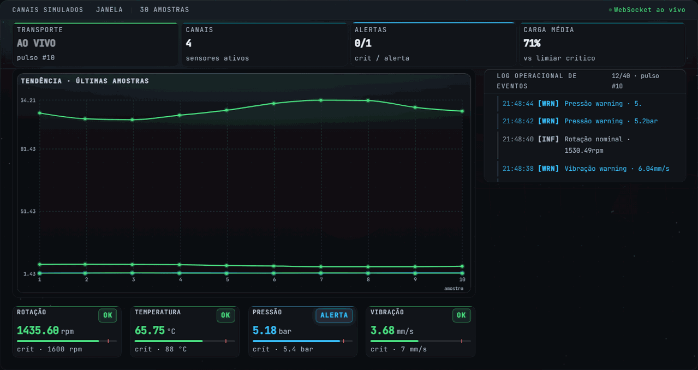

  

<h1 align="center">Vinicius Datti</h1>

Frontend Engineer • React • TypeScript • WebSocket

<a href="https://viniciusdatti-portfolio.vercel.app/">Portfolio</a> •
<a href="https://www.linkedin.com/in/vinicius-datti-791482267/">LinkedIn</a>

  

---

## About

Frontend Engineer com mais de 3 anos de experiência desenvolvendo aplicações React + TypeScript em produção.

Minha atuação está concentrada em sistemas orientados a dados, telemetria em tempo real, arquitetura de componentes e qualidade de engenharia.

Na Superior Industries participei da evolução de dashboards industriais responsáveis pelo monitoramento contínuo de equipamentos através de WebSocket, múltiplos estados operacionais, validação dinâmica de thresholds e interfaces responsivas para diferentes ambientes.

Além das funcionalidades de produto, atuei na evolução de Design Systems, documentação via Storybook, revisão de código e definição de padrões para aplicações React escaláveis.

---

## Featured Work

### Portfolio Platform

Monorepo full-stack construído para centralizar minha experiência profissional e experimentações técnicas.

**Stack principal**

- React 19
- TypeScript
- FastAPI
- PostgreSQL
- Storybook
- Vitest
- Playwright

**Capacidades demonstradas**

- Arquitetura Frontend escalável
- Integração React + FastAPI
- Testes automatizados
- Internacionalização (pt-BR / en-US)
- Design System documentado
- Telemetria em tempo real
- Observabilidade

#### Live Lab

Módulo do Portfolio Platform inspirado em cenários reais de monitoramento industrial.

Explora conceitos de:

- WebSocket
- Socket.IO
- Alertas configuráveis
- Logs operacionais
- Telemetria contínua
- Gerenciamento de estado reativo

🔗 **Portfolio:** https://viniciusdatti-portfolio.vercel.app/

---

## Professional Experience

### Superior Industries

**Frontend Engineer**  
**Fev 2023 — Mai 2026**

- Dashboards industriais em tempo real
- Telemetria via WebSocket
- Design System documentado com Storybook
- Arquitetura de componentes React
- Code Reviews
- Testes automatizados
- Integrações com APIs Python
- PostgreSQL
- TypeScript Strict

---

## Core Technologies

| Frontend | Real-Time | Quality | Backend |
|-----------|-----------|-----------|-----------|
| React | WebSocket | Vitest | FastAPI |
| TypeScript | Socket.IO | Playwright | PostgreSQL |
| Vite | Zustand | MSW | SQLAlchemy |
| Storybook | TanStack Query | Testing Library | Python |

---

## Engineering Interests

- Real-Time Systems
- Frontend Architecture
- Design Systems
- Developer Experience
- Observability
- Type-Safe Applications

---

## Contact

🌐 Portfolio  
https://viniciusdatti-portfolio.vercel.app/

💼 LinkedIn  
https://www.linkedin.com/in/vinicius-datti/
